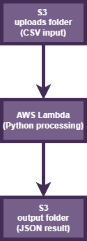

# 🚀 Serverless CSV Data Profiler (AWS S3 + Lambda + Python)

## 📌 Overview

This project is a simple event-driven data pipeline on AWS that automatically processes CSV files uploaded to an S3 bucket.

Once a file is uploaded, an AWS Lambda function is triggered to parse the dataset and generate a structured JSON summary containing basic metadata and a sample row.

---

## ⚙️ Architecture



---

## 🔄 Workflow

1. A CSV file is uploaded to the S3 bucket (`uploads/` folder)
2. The upload event triggers an AWS Lambda function
3. Lambda reads and parses the CSV file using Python (`csv` module)
4. The function extracts:
   - number of rows
   - column names
   - sample row
   - metadata (source, timestamp)
5. The result is saved back to S3 in the `output/` folder as a JSON file

---

## 🧰 Tech Stack

- AWS S3 (storage + event source)
- AWS Lambda (serverless compute)
- Python 3.x
- boto3
- csv / json

---

## 📊 Example Output
```
{
  "source_bucket": "csv-input-data-fastlookup-416338227393-eu-north-1-an",
  "source_key": "uploads/stages_TDF.csv",
  "processed_at": "2026-06-08T10:07:29.047261",
  "rows": 2236,
  "columns": [
    "Stage",
    "Date",
    "Distance",
    "Origin",
    "Destination",
    "Type",
    "Winner",
    "Winner_Country"
  ],
  "sample_row": {
    "Stage": "1",
    "Date": "2017-07-01",
    "Distance": "14",
    "Origin": "Düsseldorf",
    "Destination": "Düsseldorf",
    "Type": "Individual time trial",
    "Winner": "Geraint Thomas",
    "Winner_Country": "GBR"
  }
}
```
---

## 📁 Project Structure

```
csv-s3-lambda-profiler/
│
├── lambda_function.py
├── README.md
│
└── architecture/
│   └── csv_data_profiler.drawio.png
│
├── sample_data/
│   └── stages_TDF.csv
│
└── screenshots/
    ├── s3_upload.png
    ├── cloudwatch_log.png
    ├── event_notifications.png
    ├── output_json.png
    └── output_json_2.png
```
---

## 💡 Key Features

- Fully serverless architecture
- Event-driven processing (S3 → Lambda)
- Automatic CSV parsing and profiling
- JSON output stored in S3
- Lightweight and scalable design

---

## 📈 Possible Improvements

- Use Pandas for advanced data analysis
- Add data validation and schema detection
- Store results in DynamoDB for querying
- Extend pipeline to batch process multiple files
- Add API Gateway for external access

---

## 🧠 What this project demonstrates

- AWS serverless architecture design
- Event-driven programming
- Basic data engineering pipeline
- Python data processing skills
- Cloud automation fundamentals

---

## 📌 Author

Built as a learning project focused on AWS Lambda, S3, and serverless data processing.
